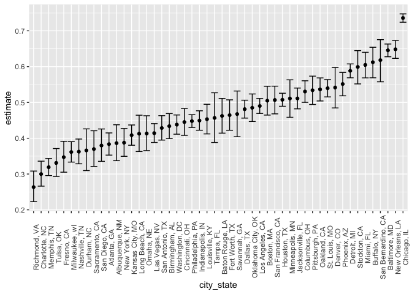
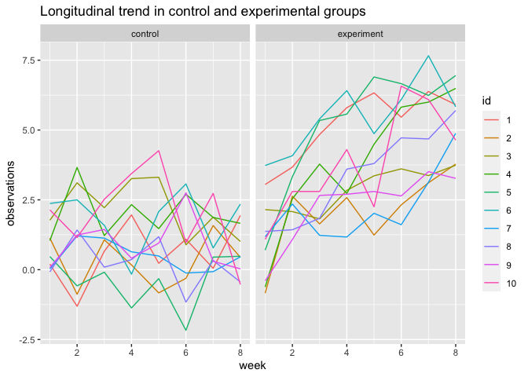

Homework 5
================
Yuki Joyama
2023-11-07

# Problem 1

``` r
library(tidyverse)

# dataset preparation
df_homicide = read_csv("./data/homicide-data.csv") |> 
  janitor::clean_names() 
```

The homicide data collected by the Washington Post has 12 columns and
52179 rows. The data set comprises information of homicide such as
incident dates, victim names, their race, gender, location, etc.

``` r
df_homicide = df_homicide |>  
  mutate(
    city_state = paste(city, state, sep = ", ") # create a city_state variable
  ) 

# the total number of homicides within cities
df_n_homicide = df_homicide |> 
  group_by(city_state) |> 
  summarise(n_homicide = n()) |> 
  arrange(desc(n_homicide))

# the number of unsolved homicides within cities
df_n_unsolved_homicide = df_homicide |> 
  filter(disposition == "Closed without arrest" | disposition == "Open/No arrest") |> 
  group_by(city_state) |> 
  summarise(n_unsolved_homicide = n()) |> 
  arrange(desc(n_unsolved_homicide))

# combine two data sets
df_n_homicide = left_join(df_n_homicide, df_n_unsolved_homicide) |> 
  drop_na()

df_n_homicide
```

    ## # A tibble: 50 × 3
    ##    city_state       n_homicide n_unsolved_homicide
    ##    <chr>                 <int>               <int>
    ##  1 Chicago, IL            5535                4073
    ##  2 Philadelphia, PA       3037                1360
    ##  3 Houston, TX            2942                1493
    ##  4 Baltimore, MD          2827                1825
    ##  5 Detroit, MI            2519                1482
    ##  6 Los Angeles, CA        2257                1106
    ##  7 St. Louis, MO          1677                 905
    ##  8 Dallas, TX             1567                 754
    ##  9 Memphis, TN            1514                 483
    ## 10 New Orleans, LA        1434                 930
    ## # ℹ 40 more rows

The above outputs show the total number of homicides and unsolved
homicides within cities. We can see that Chicago, IL has the most
homicide cases.

``` r
# estimate the proportion of homicides that are unsolved in Baltimore, MD
prop.test(x = filter(df_n_homicide, city_state == "Baltimore, MD") |> pull(n_unsolved_homicide), n = filter(df_n_homicide, city_state == "Baltimore, MD") |> pull(n_homicide)) |> 
  broom::tidy() |> 
  knitr::kable(digits = 2)
```

| estimate | statistic | p.value | parameter | conf.low | conf.high | method                                               | alternative |
|---------:|----------:|--------:|----------:|---------:|----------:|:-----------------------------------------------------|:------------|
|     0.65 |    239.01 |       0 |         1 |     0.63 |      0.66 | 1-sample proportions test with continuity correction | two.sided   |

The estimated proportion of homicides that are unsolved in Baltimore, MD
is 0.65 with 95% confidence interval 0.63 - 0.66.

``` r
# run prop.test for each of the cities
unsolved_prop_test = df_n_homicide |> 
  mutate(
    prop_test = purrr::map2(pull(df_n_homicide, n_unsolved_homicide), pull(df_n_homicide, n_homicide), \(x, y) prop.test(x = x, n = y)),
    tidy_test = purrr::map(prop_test, broom::tidy) 
  ) |> 
  unnest(tidy_test) |> 
  select(city_state, estimate, conf.low, conf.high)

# create a plot that shows the estimates and CIs for each city
unsolved_prop_test |> 
  mutate(city_state = fct_reorder(city_state, estimate)) |> 
  ggplot(aes(x = city_state, y = estimate)) +
  geom_point() +
  geom_errorbar(aes(x = city_state, ymin = conf.low, ymax = conf.high)) +
  theme(axis.text.x = element_text(angle = 90))
```

<!-- -->

The city with the lowest estimate of the proportion for unsolved
homicide is Richmond, VA. The city with the highest estimate is Chicago,
IL.

# Problem 2

``` r
# save file names as a list 
df_long = tibble(files = list.files(path = "./data/")) |>
  filter(files != "homicide-data.csv") |> # remove homicide data from problem 1
  mutate(
    data = purrr::map_df(files, ~read_csv(file.path("./data/", .))), # import csv files
    arm = case_when(
      str_starts(files, "con_") ~ "control",
      str_starts(files, "exp_") ~ "experiment"
    )
  ) |> 
  group_by(arm) |> 
  mutate(id = row_number()) |> 
  ungroup() |> 
  unnest(data) |> 
  pivot_longer(
    cols = starts_with("week"),
    names_to = "week",
    values_to = "observations"
  ) |> 
  mutate(
    week = as.numeric(str_remove(week, "week_")), # rewrite week_* to * indicating the number of the week
    id = as.factor(id)
  ) |> 
  select(-files)
```

``` r
# visualization - spaghetti plot 
# obs on each subject over time by groups
df_long |> 
  ggplot(aes(x = week, y = observations, group = id, color = id)) +
  geom_line() +
  facet_grid(~arm)
```

<!-- -->

The plots illustrate that the observed values for the experimental group
increased significantly over time, whereas the values for the control
group remained at the same level.
